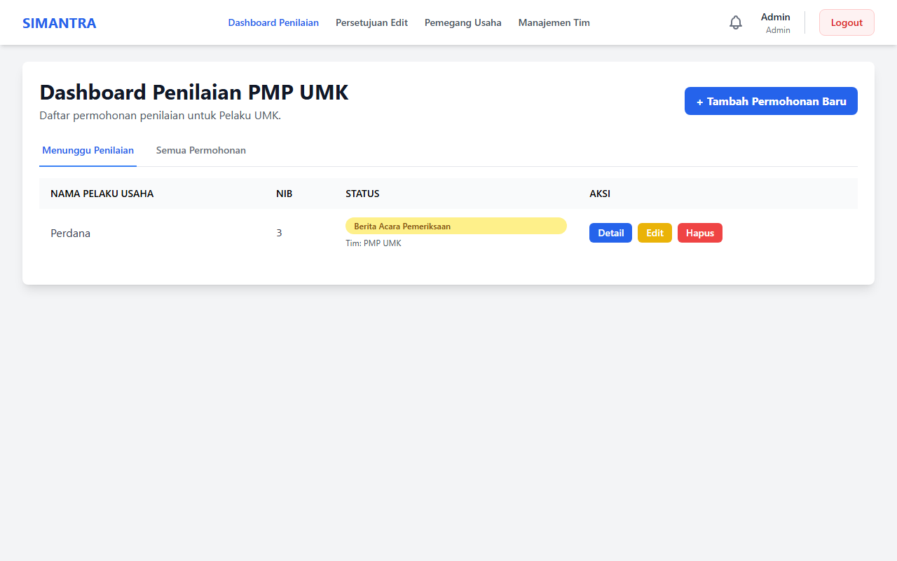
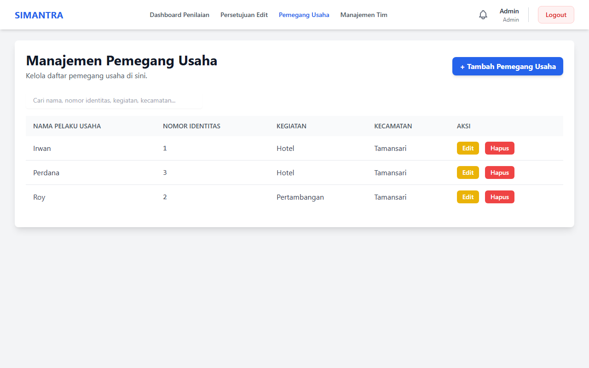
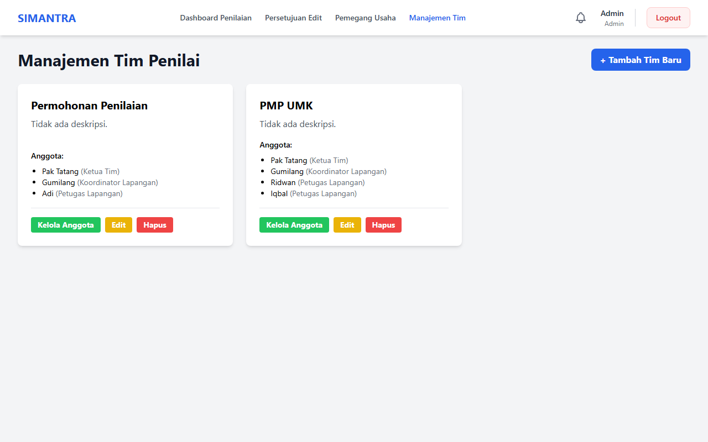

# SIMANTRA — Spatial Planning Management Information System

**SIMANTRA** (Sistem Informasi Manajemen Tata Ruang) is a web application for managing spatial planning assessments and field inspections. It features a comprehensive workflow — from assessment requests and field surveys to inspection reports, analysis forms, and final results — all with role-based access control and digital signature support.

Built as a **single Laravel application** using **Livewire 3** for interactive frontend components — no separate frontend build step required.

---

## 🚀 Tech Stack

| Technology | Version | Purpose |
|------------|---------|---------|
| PHP | ^8.2 | Server runtime |
| Laravel | ^12.0 | Web framework |
| Livewire | ^3.0 | Reactive frontend components |
| Tailwind CSS | CDN | Styling |
| Laravel Sanctum | ^4.0 | API token authentication |
| MySQL / MariaDB | 5.7+ / 10.11+ | Database |

> **No Node.js or npm required.** The frontend is rendered server-side via Blade + Livewire with Tailwind CSS loaded via CDN.

---

## 📋 Key Features

- **Session-Based Auth** — Laravel session authentication for the web interface (API routes still use Sanctum tokens)
- **Business Entity Management** — Full CRUD for assessed business entities (Pemegang Usaha)
- **Assessment Team Management** — Team creation, member assignment with role-based positions
- **Assessment Workflow** — Initiate assessments, fill PMP-UMK forms, save drafts & submit
- **Assessment Requests** — Submit and manage requests with status tracking
- **Official Reports (Berita Acara)** — Generate and preview official activity reports
- **Inspection Reports (BA Pemeriksaan)** — Field inspection forms with digital signatures
- **Assessment Analysis Form** — Comprehensive analysis with multi-role signatures
- **Assessment Results (BA Hasil)** — Input, review, and finalize assessment results
- **Notification System** — Real-time notifications for status changes
- **Edit Request Workflow** — Controlled data modification with Team Leader approval
- **Digital Signatures** — In-browser signature capture and storage for all forms

---

## 📸 Screenshots

| Dashboard | Business Entities (Pemegang) |
|---|---|
|  |  |

| Assessment Teams (Tim Penilai) |
|---|
|  |

---

## 👥 User Roles

| Role | Description |
|------|-------------|
| `Admin` | Full access to the entire system |
| `Koordinator Lapangan` | Field Coordinator — oversees field activities |
| `Ketua Tim` | Team Leader — leads assessment teams, approves edit requests |
| `Petugas Lapangan` | Field Officer — conducts surveys and assessments on-site |
| `Sekretariat` | Secretariat — handles administration and team management |

---

## 📁 Project Structure

```
├── backend/                              # Laravel 12 Application
│   ├── app/
│   │   ├── Http/Controllers/Api/        # 13 API Controllers
│   │   ├── Http/Controllers/Auth/       # Session Auth Controller
│   │   ├── Http/Middleware/             # Role-based middleware
│   │   ├── Livewire/                    # 12 Livewire Components
│   │   └── Models/                      # 16 Eloquent Models
│   ├── resources/views/
│   │   ├── auth/login.blade.php         # Login page
│   │   ├── components/layouts/          # Main layout
│   │   └── livewire/                    # 12 Livewire Blade views
│   ├── database/migrations/             # 38 Migration Files
│   ├── routes/
│   │   ├── api.php                      # API Routes (Sanctum)
│   │   └── web.php                      # Web Routes (Session auth)
│   └── .env.example
│
├── implementation_plan.html             # Migration plan document
└── README.md
```

### Livewire Components

| Component | Description |
|-----------|-------------|
| `PemegangManager` | Business entity CRUD with modal forms |
| `TimManager` | Team management with member assignment |
| `PenilaianDashboard` | Assessment dashboard with filters & role-based actions |
| `PenilaianForm` | Add/Edit assessment form |
| `PenilaianDetail` | Assessment detail view with signatures |
| `EditApproval` | Edit request approval workflow |
| `BaPemeriksaan` | Field inspection report form |
| `BeritaAcaraForm` | Official report creation |
| `BeritaAcaraPreview` | Official report preview |
| `FormulirAnalisis` | Assessment analysis form |
| `BaHasilInput` | Assessment results input |
| `BaHasilPreview` | Assessment results preview |

---

## ⚙️ Installation & Setup

### Prerequisites

- PHP >= 8.2 & Composer 2.x
- MySQL 5.7+ / MariaDB 10.11+

### 1. Clone & Install

```bash
git clone https://github.com/roytravis/Sistem-Informasi-Manajemen-Tata-Ruang.git
cd Sistem-Informasi-Manajemen-Tata-Ruang/backend
composer install
cp .env.example .env
php artisan key:generate
```

### 2. Configure Database

Edit `.env`:

```env
DB_CONNECTION=mysql
DB_HOST=127.0.0.1
DB_PORT=3306
DB_DATABASE=simantra_db
DB_USERNAME=root
DB_PASSWORD=
```

### 3. Run Migrations & Start

```bash
php artisan migrate
php artisan serve
```

> Application runs at `http://127.0.0.1:8000`

---

## 🔗 API Endpoints

The REST API remains available for mobile apps or external integrations (Sanctum token auth).

### Authentication
| Method | Endpoint | Description |
|--------|----------|-------------|
| POST | `/api/register` | Register a new user |
| POST | `/api/login` | Login and receive a token |
| POST | `/api/logout` | Logout (auth required) |
| GET | `/api/user` | Get authenticated user info |

### Business Entities
| Method | Endpoint | Description |
|--------|----------|-------------|
| GET | `/api/pemegangs` | List all business entities |
| POST | `/api/pemegangs` | Create a business entity |
| GET | `/api/pemegangs/{id}` | Get details |
| PUT | `/api/pemegangs/{id}` | Update |
| DELETE | `/api/pemegangs/{id}` | Delete |

### Assessment Teams
| Method | Endpoint | Description |
|--------|----------|-------------|
| GET | `/api/tims` | List all teams |
| POST | `/api/tims` | Create a team |
| PUT | `/api/tims/{id}` | Update a team |
| DELETE | `/api/tims/{id}` | Delete a team |
| POST | `/api/tims/{id}/members` | Add member |
| DELETE | `/api/tims/{id}/members` | Remove member |

### Assessments
| Method | Endpoint | Description |
|--------|----------|-------------|
| POST | `/api/penilaian/initiate/{id}` | Initiate an assessment |
| GET | `/api/penilaian/pmp-umk/{kasus}` | View PMP-UMK form |
| POST | `/api/penilaian/pmp-umk/{kasus}` | Submit assessment |
| POST | `/api/penilaian/pmp-umk/{kasus}/draft` | Save draft |

### Reports & Forms
| Method | Endpoint | Description |
|--------|----------|-------------|
| POST | `/api/berita-acara` | Create official report |
| GET | `/api/berita-acara/{id}` | View official report |
| POST | `/api/ba-pemeriksaan` | Save inspection report |
| GET | `/api/ba-pemeriksaan/{id}` | View inspection report |
| GET | `/api/formulir-analisis/{id}` | View analysis form |
| POST | `/api/formulir-analisis/{id}` | Save analysis form |
| GET | `/api/ba-hasil-penilaian/{id}` | View results |
| POST | `/api/ba-hasil-penilaian` | Save results |

### Notifications & Edit Requests
| Method | Endpoint | Description |
|--------|----------|-------------|
| GET | `/api/notifications` | List notifications |
| POST | `/api/notifications/{id}/read` | Mark as read |
| POST | `/api/edit-requests` | Submit edit request |
| POST | `/api/edit-requests/{id}/process` | Approve/reject |

---

## 📱 Web Pages

| Route | Component | Description |
|-------|-----------|-------------|
| `/login` | Login (Blade) | User authentication |
| `/penilaian` | PenilaianDashboard | Main dashboard |
| `/penilaian/tambah` | PenilaianForm | Create new assessment |
| `/penilaian/{id}` | PenilaianDetail | Assessment details |
| `/penilaian/{id}/edit` | PenilaianForm | Edit assessment |
| `/penilaian/persetujuan-edit` | EditApproval | Approve/reject edits |
| `/pemegangs` | PemegangManager | Manage business entities |
| `/tims` | TimManager | Manage teams & members |
| `/penilaian/{id}/berita-acara-pemeriksaan` | BaPemeriksaan | Inspection report |
| `/penilaian/{id}/formulir-analisis` | FormulirAnalisis | Analysis form |
| `/penilaian/{id}/ba-hasil/input` | BaHasilInput | Results input |
| `/penilaian/{id}/ba-hasil/preview` | BaHasilPreview | Results preview |
| `/penilaian/berita-acara/tambah` | BeritaAcaraForm | Create official report |
| `/penilaian/berita-acara/{id}/preview` | BeritaAcaraPreview | Preview official report |

---

## 🧪 Testing

```bash
cd backend
php artisan test
```

---

## 📄 License

MIT License
